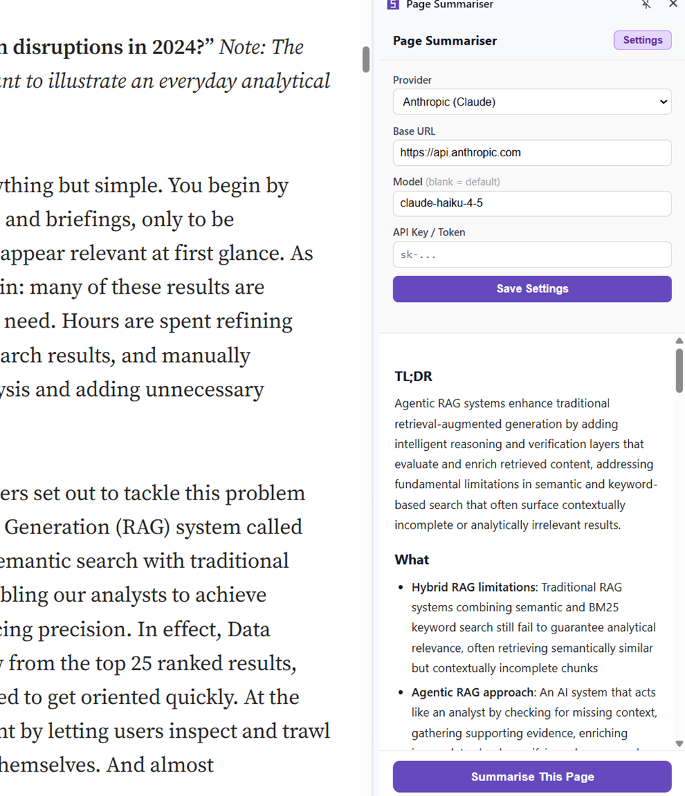
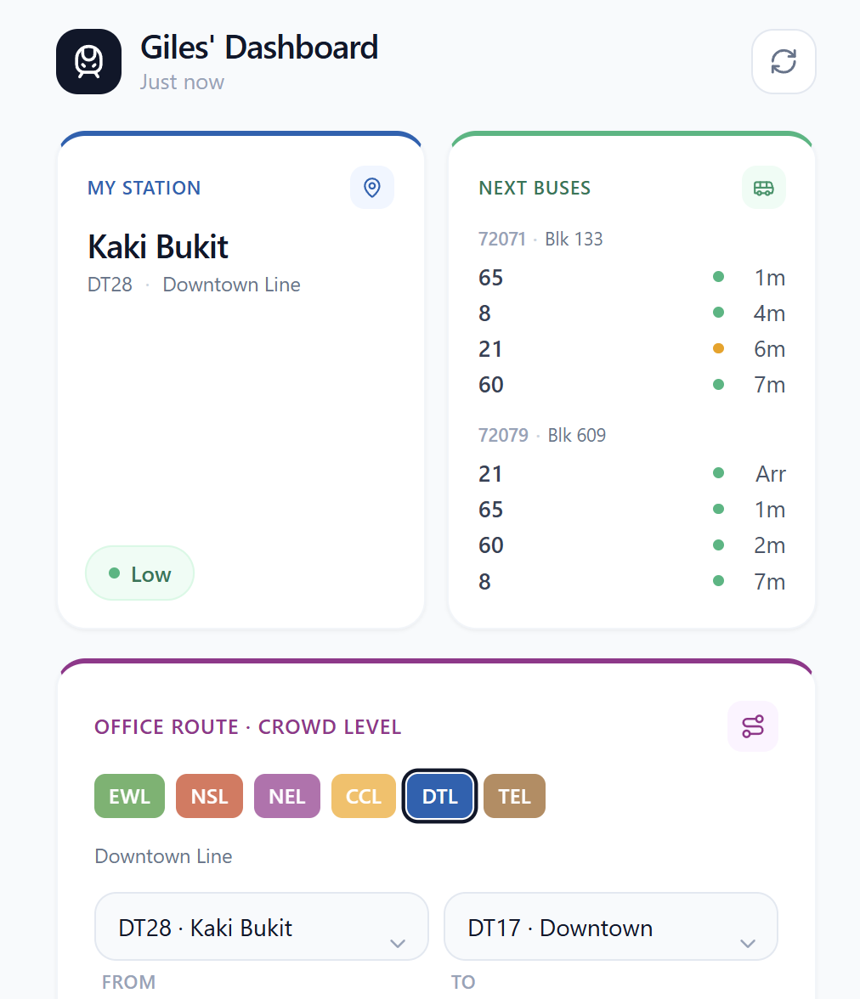

<h1 align="center">Hey , I'm Giles!!</h1>

###  About Me:
- 🏦 I'm a SWE working at Zendesk 
       @[the second me](https://github.com/giles-chang)
- 💻 I use daily: **.java**, **.rb**, **.js**, **.py**,  **.sql**
- 🤔 I specialise in scalable systems, race conditions, and creating products for the broader audience.
- 📖 I am currently reading **Designing Data intensive applications** by Martin Kleppman
- 👯 Would love to connect to chat! 
- ⚡ Fun fact: I have a cat! 😻
- 🧑‍💻 Tech I work on :

      

---

### 🚀 Projects

<table>
  <tr>
    <td width="50%" valign="top">
      <h3 align="center">📄 Page Summariser</h3>
      

        
        
<b>Chrome · JavaScript</b>

      

      
A lightweight Chrome extension that turns dense, sprawling articles into clean, structured TL;DRs. Just drop in your API key, hit <b>Summarise</b>, and read any complex Medium article in seconds.

      

        
      

    </td>
    <td width="50%" valign="top">
      <h3 align="center">🚆 Transport Dashboard</h3>
      

        
        
<b>Java · Docker · Cloud Run</b>

      

      
My own dashboard where I can see everything that matters to my commute in one glance. Live data is pulled from the <b>LTA DataMall</b> and <b>OneMap</b> APIs, then build in my own metrics like <b>train crowd levels</b> and ranked using Djkstra (yes lol) 

      

        
      

    </td>
  </tr>
  <tr>
    <td align="center" valign="top">
      
    </td>
    <td align="center" valign="top">
      
    </td>
  </tr>
</table>

---

###  My Github Stats:

<!--START_SECTION:waka-->

<!--
**gilesccs/gilesccs** is a ✨ _special_ ✨ repository because its `README.md` (this file) appears on your GitHub profile.

Here are some ideas to get you started:

- 🔭 I’m currently working on ...
- 🌱 I’m currently learning ...
- 👯 I’m looking to collaborate on ...
- 🤔 I’m looking for help with ...
- 💬 Ask me about ...
- 📫 How to reach me: ...
- 😄 Pronouns: ...
- ⚡ Fun fact: ...
-->
